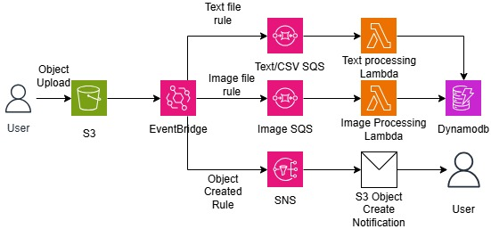
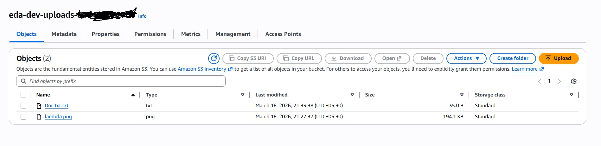
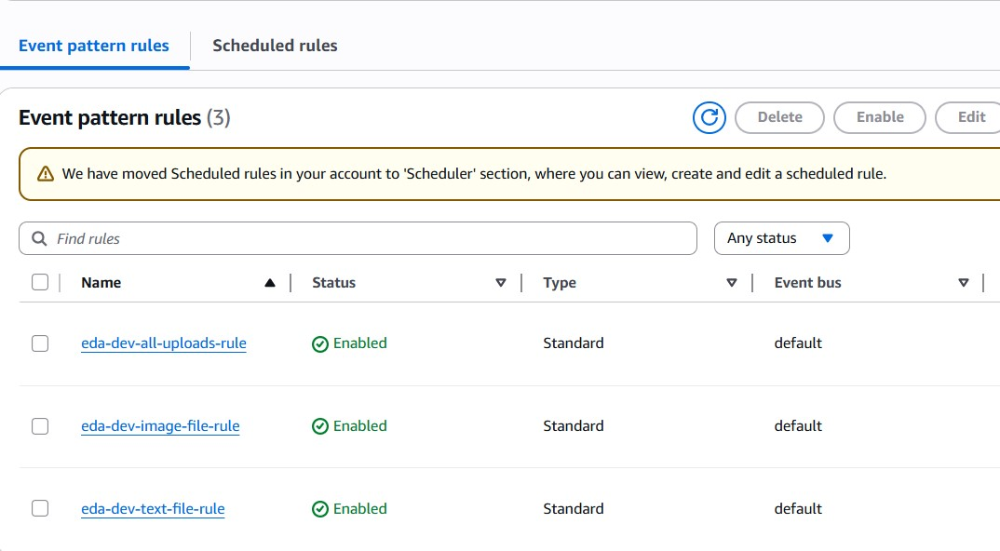
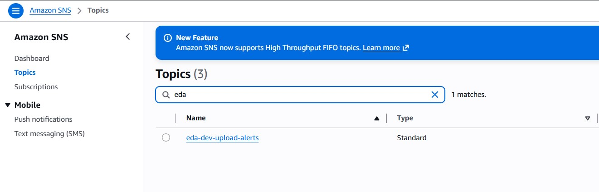
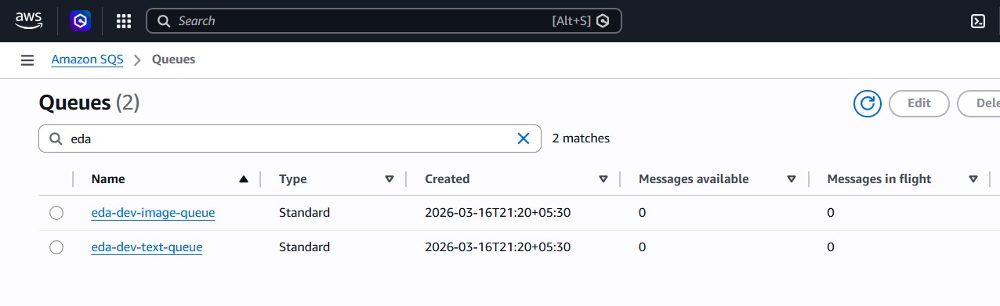
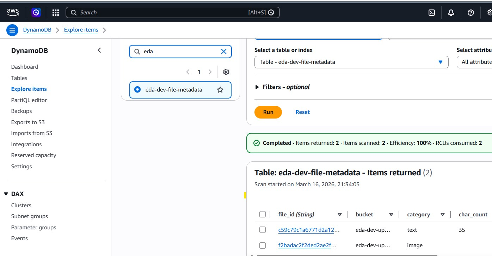
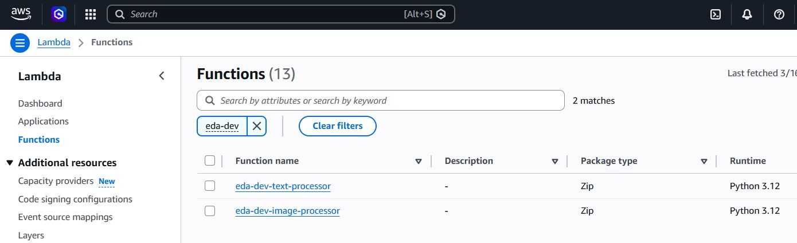
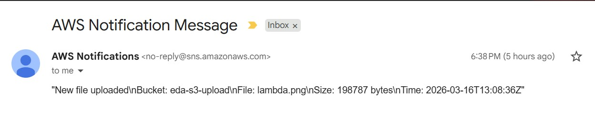

## Architecture Overview And High Level Design

## Architecture

This repository demonstrates how to implement a scalable Event-Driven Architecture (EDA) on AWS .

The architecture processes files uploaded to Amazon S3 and routes them through an event-driven pipeline for asynchronous processing and metadata storage.

The solution uses fully managed AWS services to build a loosely coupled, serverless architecture that can scale based on event volume.

## High Level Design

The solution is built using the following AWS services:

Amazon S3 – File ingestion layer

Amazon EventBridge – Event routing and filtering

Amazon SQS – Message buffering and decoupling

AWS Lambda – Event processing

Amazon DynamoDB – Metadata storage

Amazon SNS – Upload notifications

## Architecture Flow

Files are uploaded to an S3 bucket.

EventBridge captures the ObjectCreated event.

EventBridge rules route events based on file type.

Events are delivered to SQS queues.

Lambda functions process the events asynchronously.

Processed metadata is stored in DynamoDB.

SNS sends notifications for upload events.

## Event-Driven Architecture Layers

This implementation follows typical EDA layers:

## Layer	Service
Ingestion Layer - 	Amazon S3
Event Routing Layer - Amazon EventBridge
Messaging Layer - 	Amazon SQS
Processing Layer - 	AWS Lambda
Data Layer	Amazon -  DynamoDB
Notification Layer - 	Amazon SNS

## Use Case

This architecture pattern is commonly used in scenarios such as:

Document ingestion pipelines

Media processing workflows

Data ingestion systems

Serverless event processing platforms

Metadata extraction pipelines

## Installation Setup

This Architecture can be created through terraform code provided in the repository. 
Once Setup is complete, User can test it by uploading text, csv and images in S3 bucket .

* Note : Email Subscriptions should be in confirmed state in ordere to recieve Email Notifications once a object a created in S3 bucket 

## Sample Screenshots of setup and end results

